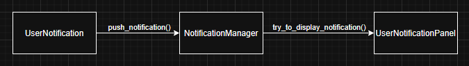
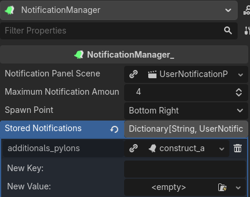

# Seeker's Simple Notifications - Documentation

- [Seeker's Simple Notifications - Documentation](#seekers-simple-notifications---documentation)
	- [Setup](#setup)
	- [Basic Architecture](#basic-architecture)
	- [Pushing a New Notification](#pushing-a-new-notification)
	- [Stored Notification](#stored-notification)
		- [Storing](#storing)
		- [Pushing](#pushing)
	- [Tips, Tricks \& Helpers](#tips-tricks--helpers)

Recommended : install [Markdown GDScript](https://marketplace.visualstudio.com/items?itemName=jkbo.gdscript-markdown-fenced-codeblock) to enable syntaxic coloration of GDScript inside Markdown code blocks !

If you didn't, you should probably read [README.md](README.md) before !

## Setup

1. Open your project in Godot 4.6+
2. Add the Simple Notification's folder to your project.
3. Add NotificationManager as an autoload named NotificationManager.
4. Launch the demo scene and check that everything is working properly.

## Basic Architecture

- `UserNotification` represent a single notification instance.
- `UserNotificationPanel` is a Control/UI Scene that display the `UserNotification` data.
- `NotificationManager` well, manage them. Handle queueing and stored `UserNotification`. `UserNotificationPanel` are added as their child.

## Pushing a New Notification

1. Create a new `UserNotification`.
2. Change the values if you need to.
3. Push it to the `NotificationManager`.

The `NotificationManager` handles all the displaying part.

```gdscript
func send_new_notification() -> void:
	var notif: UserNotification = UserNotification.new()
	notif.title = "Hello World !"
	notif.text = "This is a long long description"
	notif.icon = load("path/to/your/Texture2D")
	notif.on_spawn_sfx = load("path/to/your/AudioStream")

	NotificationManager.push_notification(notif)
```

  
*What happens when you push a notification*

## Stored Notification

Stored notifications are "presets" notifications that are named and stored inside `NotificationManager`. You can invoke them by just calling their name. They are really useful if you're going to send the same notification over and over, or have static notifications (like achievements).

### Storing

Stored notifications can be added to your projects by :

1. Creating the `UserNotification` resource in your Godot filesystem then adding it to the `NotificationManager.tscn` scene properties via the inspector.
2. Calling `NotificationManager.store_notification(notification: UserNotification)` in code.

  
*A stored notification has been added, named `additionals_pylons`*

### Pushing

Simply call `NotificationManager.push_stored_notification(notification_name: String)` !

This is how I push `additionals_pylons` to the notification queue :

```gdscript
	NotificationManager.push_stored_notification("additionals_pylons")
```

## Tips, Tricks & Helpers

- Use `NotificationManager.get_visible_notifications()` to get all currently displayed `UserNotificationPanel`.
- Use `NotificationManager.remove_visible_notifications()` to clear the screen but not the queue.
- Use `NotificationManager.empty_queue()` to empty the queue.
- Use `NotificationManager.remove_all_notifications()` to both empty the queue and remove all the notification on screen.
- `UserNotificationPanel` has a `clicked` signal that you can connect to. It can be used to create interactive notifications !
- Remember that `UserNotificationPanel` has a reference to the `UserNotification` used to create them. This can be used to make notifications that hold data !

Go read about [Customization](CUSTOMIZATION.md) now !
